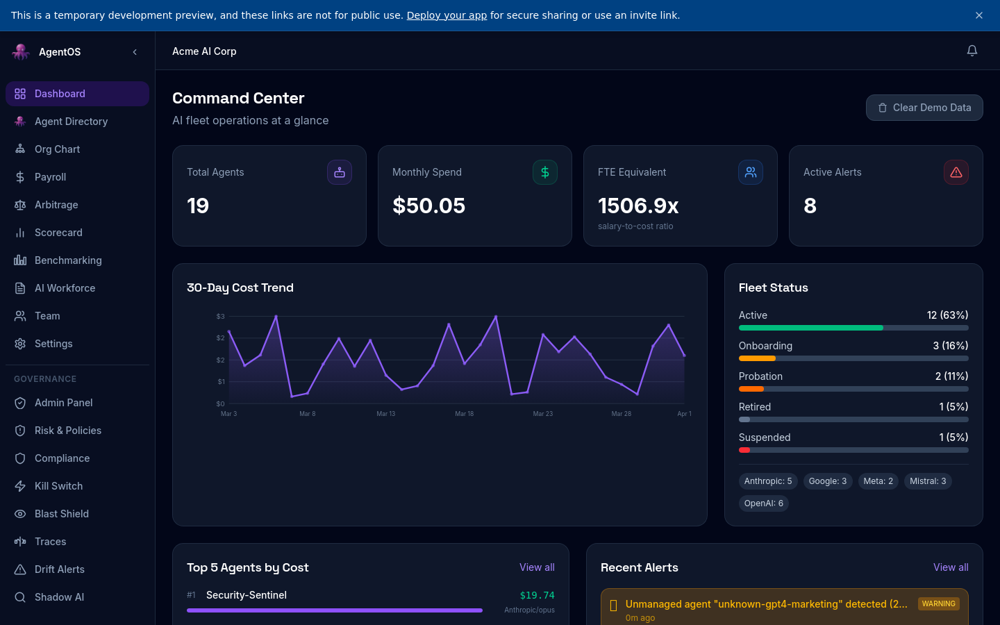
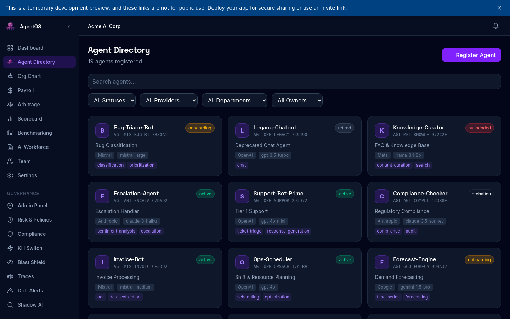
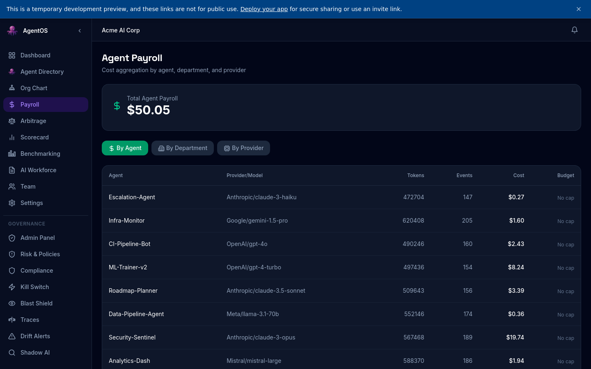
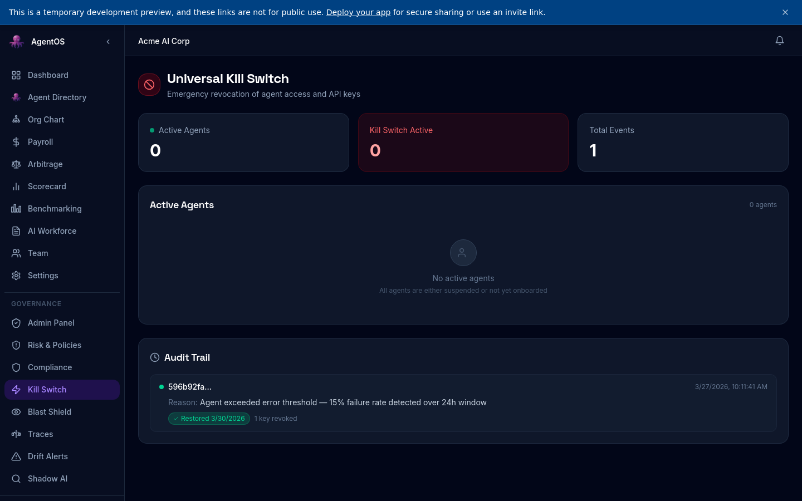
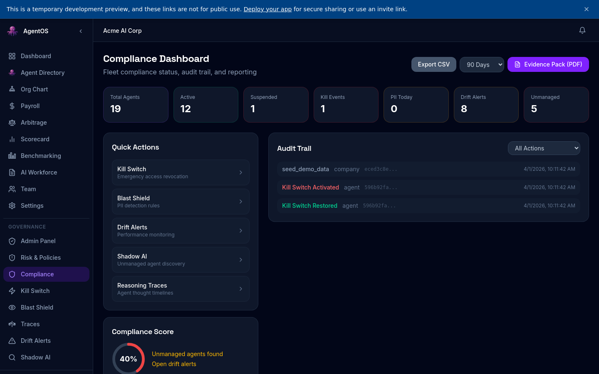
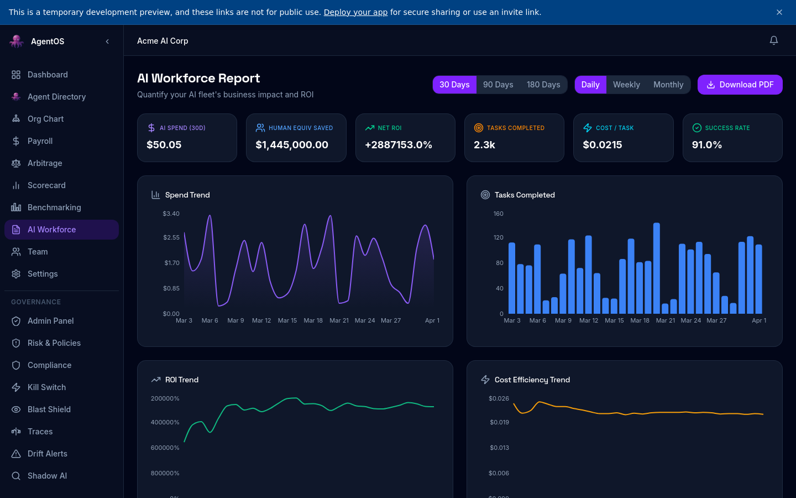

<div align="center">

# 🐙 AgentOS

**The Operating System for AI Agents**

Monitoring · Governance · Token Payroll · Compliance

[](LICENSE)
[](https://github.com/sachinramos/AgentOS/stargazers)
[](https://github.com/sachinramos/AgentOS/network)
[](https://github.com/sachinramos/AgentOS/issues)
[](https://www.typescriptlang.org/)
[](https://react.dev/)
[](https://nodejs.org/)
[](https://www.postgresql.org/)
[](docker-compose.yml)
[](CONTRIBUTING.md)
[](https://discord.gg/vbdV7YyW)

[Live Demo](https://agentos.dev) · [Quick Start](#quick-start) · [Discord](https://discord.gg/vbdV7YyW) · [Contributing](CONTRIBUTING.md)

</div>

---


---

## Demo

<div align="center">
  <a href="https://www.youtube.com/watch?v=Sgnu2XwWniA">
    
  </a>
  <p><em>Click to watch the full walkthrough on YouTube</em></p>
</div>

---

## Screenshots

<div align="center">

| Dashboard | Agent Directory |
|:-:|:-:|
|  |  |

| Token Payroll | Kill Switch (Governance) |
|:-:|:-:|
|  |  |

| Compliance Dashboard | AI Workforce Report |
|:-:|:-:|
|  |  |

</div>

---

## What is AgentOS?

AgentOS is a full-stack platform that gives engineering and ops teams a single pane of glass for every AI agent in the organisation — no matter the provider, model, or framework.

Think of it as **"HR software, but for AI agents."**

| Problem | AgentOS Solution |
|---|---|
| Agents scattered across teams with zero visibility | **Agent Directory** — register, tag, and search every agent |
| No idea what agents cost | **Token Payroll** — per-agent cost tracking with budget caps |
| Compliance gaps | **Governance Suite** — kill switch, PII shield, drift alerts |
| Shadow AI proliferating | **Shadow AI Radar** — discover unregistered agents automatically |
| No performance benchmarks | **Scorecard & Benchmarking** — compare models, providers, and agents |

---

## Features

### Core Platform
- **Agent Directory** — register agents from any provider (OpenAI, Anthropic, Google, Meta, Mistral, xAI, DeepSeek, Cohere, and 10+ more)
- **Interactive Org Chart** — visualise your AI workforce hierarchy by department
- **Dashboard & Command Centre** — real-time KPIs: active agents, total spend, tasks completed, success rate
- **Multi-tenant** — isolated company workspaces with role-based access (admin, manager, viewer)
- **Onboarding Wizard & Product Tour** — guided setup for new organisations

### Financial
- **Token Payroll** — per-agent cost tracking with automatic token accounting and budget caps
- **Arbitrage Calculator** — compare model pricing across providers to find savings
- **Budget Alerts** — configurable thresholds with notifications before spend spirals

### Governance & Compliance
- **Kill Switch** — instantly disable any agent with full audit trail and one-click restore
- **Blast Shield (PII)** — regex-based PII detection and redaction on agent inputs/outputs
- **Reasoning Traces** — inspect every step of agent decision-making with structured trace logs
- **Drift Alerts** — detect behavioural drift vs. baseline with acknowledge/dismiss workflow
- **Shadow AI Radar** — discover unregistered agents and bring them under governance
- **Risk Policies** — codify IF/AND rules with auto-actions and violation logging
- **Compliance Dashboard** — exportable evidence packs for auditors (PDF with cover page, executive summary, full audit trail)

### Analytics
- **AI Workforce Report** — fleet-wide KPIs with 30/90/180-day trend analysis, provider breakdown, department breakdown, human-vs-AI cost comparison
- **Performance Scorecard** — rate and track agent effectiveness over time
- **Benchmarking** — head-to-head model and provider comparison

---

## Architecture

```
┌──────────────────────────────────────────────────┐
│                    Frontend                       │
│  React 18 · Tailwind CSS · Framer Motion          │
│  wouter routing · Recharts · Radix UI             │
│  20+ dashboard pages · dark/light theme           │
└──────────────────────┬───────────────────────────┘
                       │ REST API (JWT + RBAC)
┌──────────────────────▼───────────────────────────┐
│                    Backend                        │
│  Express · TypeScript · Drizzle ORM               │
│  Zod validation · role-based middleware            │
│  Telemetry interceptor · risk scoring engine       │
└──────────────────────┬───────────────────────────┘
                       │
┌──────────────────────▼───────────────────────────┐
│                 PostgreSQL                        │
│  25+ tables · telemetry events · audit logs       │
│  multi-tenant isolation · JSONB settings           │
└──────────────────────────────────────────────────┘
```

---

## Quick Start

### One-command Docker setup (recommended)

```bash
git clone https://github.com/sachinramos/AgentOS.git && cd AgentOS
echo "SESSION_SECRET=$(openssl rand -hex 32)" > .env
docker compose up -d
```

The database schema is applied automatically on first boot. Open [http://localhost:5000](http://localhost:5000) and register your first company. That's it.

### Manual setup

```bash
git clone https://github.com/sachinramos/AgentOS.git && cd AgentOS
npm install
cp .env.example .env                    # Edit DATABASE_URL and SESSION_SECRET
npm run db:push                          # Create tables
npm run dev                              # http://localhost:5000
```

### Make targets

```bash
make setup    # Install deps + push DB schema
make dev      # Start dev server
make seed     # Populate demo data after registration
```

> **Prerequisites:** Node.js 20+ and PostgreSQL 15+ (or just Docker).
>
> **Production:** Always set strong, unique values for `POSTGRES_PASSWORD`, `SESSION_SECRET`, and `AGENT_KEY_SECRET`.

---

## Project Structure

```
AgentOS/
├── client/                          # React frontend
│   └── src/agentos/
│       ├── AgentOSApp.tsx           # Main app shell with routing & sidebar
│       ├── pages/
│       │   ├── AgentOSLanding.tsx   # Public landing page
│       │   ├── Dashboard.tsx        # Main dashboard with KPIs
│       │   ├── AgentDirectory.tsx   # Agent registry & search
│       │   ├── AgentDetail.tsx      # Individual agent detail view
│       │   ├── Payroll.tsx          # Token cost tracking
│       │   ├── Governance.tsx       # Kill switch controls
│       │   ├── ComplianceDashboard  # Compliance & evidence packs
│       │   ├── BlastShield.tsx      # PII detection & redaction
│       │   ├── ReasoningTraces.tsx  # Agent decision trace viewer
│       │   ├── DriftAlerts.tsx      # Behavioural drift monitoring
│       │   ├── ShadowAI.tsx         # Unregistered agent discovery
│       │   ├── OrgChart.tsx         # Visual org hierarchy
│       │   ├── Scorecard.tsx        # Performance ratings
│       │   ├── Benchmarking.tsx     # Model comparison
│       │   ├── WorkforceReport.tsx  # Fleet analytics
│       │   ├── RiskPolicies.tsx     # Risk rule management
│       │   ├── ArbitrageCalculator  # Provider cost comparison
│       │   └── ...                  # Login, Register, Settings, Admin
│       └── lib/
│           ├── api.ts               # API client
│           └── models.ts            # Provider/model definitions
├── server/
│   └── agentos/
│       ├── routes.ts                # Express API routes (2900+ lines)
│       ├── storage.ts               # Drizzle storage interface
│       ├── telemetry.ts             # OpenAI telemetry interceptor
│       ├── seed.ts                  # Demo data seeding
│       └── ziphireAgents.ts         # Internal agent auto-registration
├── shared/
│   └── agentos-schema.ts            # Drizzle schema (25+ tables)
├── docker-compose.yml
├── .env.example
└── package.json
```

---

## Supported Providers

| Provider | Models |
|---|---|
| OpenAI | GPT-4.1, GPT-4.1-mini, GPT-4o, o3, o4-mini |
| Anthropic | Claude 4 Sonnet/Opus, Claude 3.7/3.5 Sonnet, Claude 3.5 Haiku |
| Google | Gemini 2.5 Pro/Flash, Gemini 2.0 Flash, Gemini 1.5 |
| Meta | Llama 4 Maverick/Scout, Llama 3.3-70b, Llama 3.1-405b |
| Mistral | Large, Medium, Small, Codestral |
| xAI | Grok 3, Grok 3 Mini, Grok 2 |
| DeepSeek | R1, V3, Chat |
| Cohere | Command R+, Command R, Command A |
| Kimi | Kimi K2, Moonshot V1 |
| Manus | Manus-1 |
| Perplexity | Sonar Pro, Sonar, Sonar Reasoning Pro |
| AI21 | Jamba 2.0 Large/Mini |
| Amazon | Nova Pro/Lite/Micro |
| Alibaba (Qwen) | Qwen 3, Qwen 2.5 Max/Plus |
| Microsoft | Phi-4, Phi-4 Mini |
| Sarvam | Sarvam-1, Sarvam-M, 30B, 105B |
| Custom | Bring your own model |

---

## Agent Templates

Get started quickly with ready-made agent definitions in the `templates/` directory:

| Template | Provider | Use Case |
|---|---|---|
| [`customer-support-bot.yaml`](templates/customer-support-bot.yaml) | OpenAI GPT-4o | Tier-1 customer support |
| [`compliance-sentinel.yaml`](templates/compliance-sentinel.yaml) | Anthropic Claude 3.5 | Compliance monitoring & audit |
| [`code-review-agent.yaml`](templates/code-review-agent.yaml) | Anthropic Claude 4 | Pull request code review |

> **Want to add your own template?** See [CONTRIBUTING.md](CONTRIBUTING.md) — template PRs are the fastest way to contribute.

---

## Community

- **Discord** — [discord.gg/vbdV7YyW](https://discord.gg/vbdV7YyW)
- **GitHub Issues** — [Report bugs or request features](https://github.com/sachinramos/AgentOS/issues)
- **Contributing** — [Read the guide](CONTRIBUTING.md)

---

## Built with AgentOS

> Using AgentOS? Open a PR to add your project here.

*Your project could be the first on the list.*

---

## Contributing

We love contributions! Please read our [Contributing Guide](CONTRIBUTING.md) and [Code of Conduct](CODE_OF_CONDUCT.md) before submitting a PR.

---

## License

AgentOS is released under the [MIT License](LICENSE).

Copyright (c) 2025 Ziphire

---

<div align="center">

**If you believe AI agents need governance, give us a star.**

[](https://github.com/sachinramos/AgentOS)

<strong>Built with 🐙 by <a href="https://ziphire.hr">Ziphire</a></strong>

</div>
